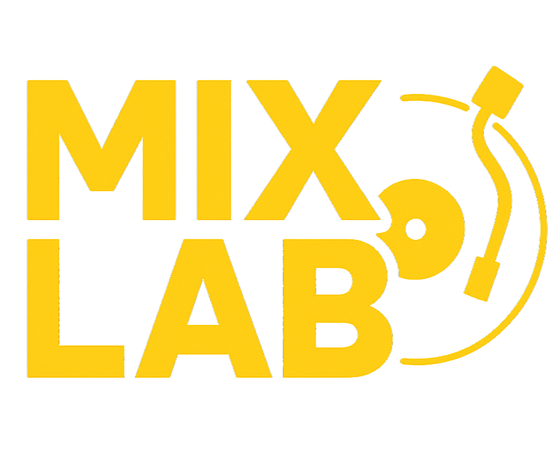

# MixLab DJ 🎛️

A modern, professional DJ application built with PyQt6 featuring a sleek glassmorphism-inspired UI, real-time audio analysis, and advanced mixing capabilities.



##  Features

###  Core DJ Features
- **Dual Deck System**: Two independent decks with synchronized playback
- **Real-time Waveform Visualization**: See your music with beautiful, responsive waveforms
- **Crossfader Control**: Smooth transitions between decks with adjustable crossfader
- **Volume Control**: Independent volume sliders for each deck
- **Track Progress**: Visual progress bars with time display and seeking capability
- **Playback Controls**: Play, pause, stop, and loop functionality

###  Audio Support
- **Multiple Formats**: MP3, WAV, FLAC
- **High-Quality Audio**: Professional-grade audio processing
- **Real-time Analysis**: BPM detection and audio analysis
- **Equalizer**: Built-in equalizer

###  User Interface
- **Modern Glassmorphism Design**: Sleek, translucent interface with blur effects
- **Dark Mode**: Easy on the eyes for extended mixing sessions
- **Responsive Layout**: Adapts to different screen sizes
- **Intuitive Controls**: Professional DJ-style interface

###  Advanced Features
- **Recording Capability**: Record your mixes directly from the application
- **Audio Analysis Bridge**: Native C++ audio processing for optimal performance
- **Cache Management**: Smart caching for improved performance
- **File Management**: Organized track library and playlist support

##  Quick Start

### Prerequisites
- **Python 3.10+** 
- **Audio drivers** (ALSA/PulseAudio on Linux, Core Audio on macOS, DirectSound on Windows)

> **Note**: Pre-built audio analyzer libraries are included for all platforms. CMake is only required if you want to rebuild the libraries from source.

### Installation

1. **Install Python dependencies**
```bash
pip install -r requirements.txt
```

2. **Run the application**
```bash
python djapp.py
```

##  Usage Guide

### Basic Controls

| Control | Description |
|---------|-------------|
| **Load** | Click "Load" on either deck to select an audio file |
| **Play/Pause** | Toggle playback for each deck independently |
| **Volume Slider** | Adjust volume for each deck (vertical sliders) |
| **Progress Bar** | Seek through tracks and view current position |
| **Crossfader** | Mix between decks (bottom horizontal slider) |
| **Equalizer** | Adjust frequency bands for each deck |

#### Using the Equalizer
- Adjust frequency bands (low, mid, high)

##  Project Structure

```
DjApp/
├── djapp.py                 # Main application entry point
├── deck_widgets.py          # Deck UI components and logic
├── waveform.py              # Waveform visualization
├── equalizer.py             # Equalizer functionality
├── visualization.py         # Audio visualization components
├── turntable.py            # Turntable simulation effects
├── file_management.py      # File handling and organization
├── cache_manager.py        # Performance optimization
├── recording_worker.py     # Recording functionality
├── audio_analyzer_bridge.py # Python-C++ bridge interface
├── tutorial.py             # Built-in tutorial system
├── styles.qss              # Qt stylesheet for UI theming
├── requirements.txt        # Python dependencies
└── [Platform-specific audio libraries]
```

##  Configuration

### Audio Settings
The application uses the following audio systems:
- **Playback**: PyQt6's QMediaDevices for audio output (automatically detects available devices)
- **Recording**: sounddevice library for capturing system audio output
- **Platform Support**: 
  - **Windows**: Uses DirectSound through PyQt6 and sounddevice
  - **macOS**: Uses Core Audio through PyQt6 and sounddevice  
  - **Linux**: Uses ALSA/PulseAudio through PyQt6 and sounddevice

The app automatically lists available audio devices on startup and uses the system default for playback.

##  Troubleshooting

### Common Issues

#### Audio Not Playing
- Check your system's audio output settings
- Ensure the correct audio device is selected
- Verify audio file format is supported

#### Performance Issues
- Close other audio applications

#### Build Errors
- Verify Python version is 3.10+
- Check that all Python dependencies are installed
- If rebuilding audio libraries: Ensure CMake 3.10+ is installed


##  Acknowledgments

- **PyQt6** for the GUI framework
- **PortAudio** for cross-platform audio I/O
- **libsndfile** for audio file format support
- **NumPy/SciPy** for signal processing
- **FFmpeg** for additional audio format support


**MixLab DJ** - Professional DJ software for the modern era 🎧